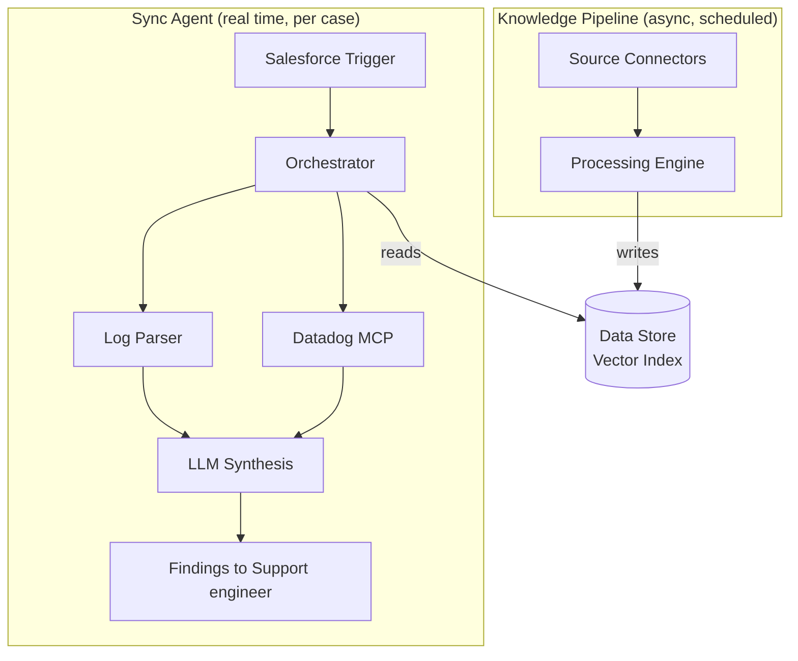

# Architecture

## Overview

The system has two distinct layers that share a data store but operate independently.

The pipeline writes to the store on a schedule. The agent reads from it during a case investigation, alongside live Datadog signal and the customer's own attachments. The two layers share the store and nothing else.

---

## Principles

**External to Salesforce.** Salesforce is a trigger and a data source. It is not the brain. This keeps the system portable if the CRM changes.

**Async before sync.** The knowledge pipeline runs independently of any customer interaction. By the time the agent needs to look something up, the work is already done.

**Human in the loop.** No response reaches a customer without support engineer approval. This is a design constraint, not a roadmap item.

**Component boundaries are explicit.** Each component has one job. Orchestration does not process data. Connectors do not store data. This makes it easier to swap out individual pieces as requirements evolve.

---

## Component Summary

| Component | Job | Layer |
|---|---|---|
| Orchestration Engine | Schedules and sequences jobs, handles failures | Both |
| Source Connectors | Pull raw data from each indexed source API | Pipeline |
| Processing Engine | Cleans, chunks, extracts via LLM | Pipeline |
| Data Store | Persists structured knowledge for search | Shared |
| SF Trigger | Fires on case creation, calls the agent via HTTP | Sync |
| Log Parser | Extracts timestamps, error codes, identifiers from customer-submitted attachments | Sync |
| Datadog MCP Client | Queries Datadog for time-correlated server-side signal | Sync |
| LLM Synthesis | Combines case data, parsed logs, Datadog signal, and historical matches into findings | Sync |
| Findings Delivery | Routes findings to the support engineer (Slack, case comment, or email; pending) | Sync |

---

## Technology Decisions

Some decisions are made. Others depend on what ops and engineering already have.

**Decided:**
- Orchestration: n8n (self-hosted, Docker-native, visual workflow builder). Subject to override if an existing Airflow or Prefect setup is already in place.
- LLM: Anthropic API (Claude). Confirmed pending budget sign-off.
- Salesforce integration: Flow + HTTP callout + Apex REST class, same pattern as the existing support portal onboarding flow.

**Proposed, pending ops/engineering confirmation:**
- Vector database: pgvector if a managed Postgres exists, otherwise Qdrant. See [ADR-002](../decisions/adr-002-data-store-tbd.md).
- Hosting environment: co-located with the existing Zendesk archive container.
- Secrets management: whatever's already in use. Doppler or 1Password Connect if nothing is.

**Still open:**
- Whether an existing data pipeline or message queue should replace the n8n scheduler if Phase 1 volume turns out higher than expected.

See [ADR-001](../decisions/adr-001-external-orchestration.md) and [ADR-002](../decisions/adr-002-data-store-tbd.md) for the reasoning behind these decisions, and [Open Questions](05-open-questions.md) for the full list.
