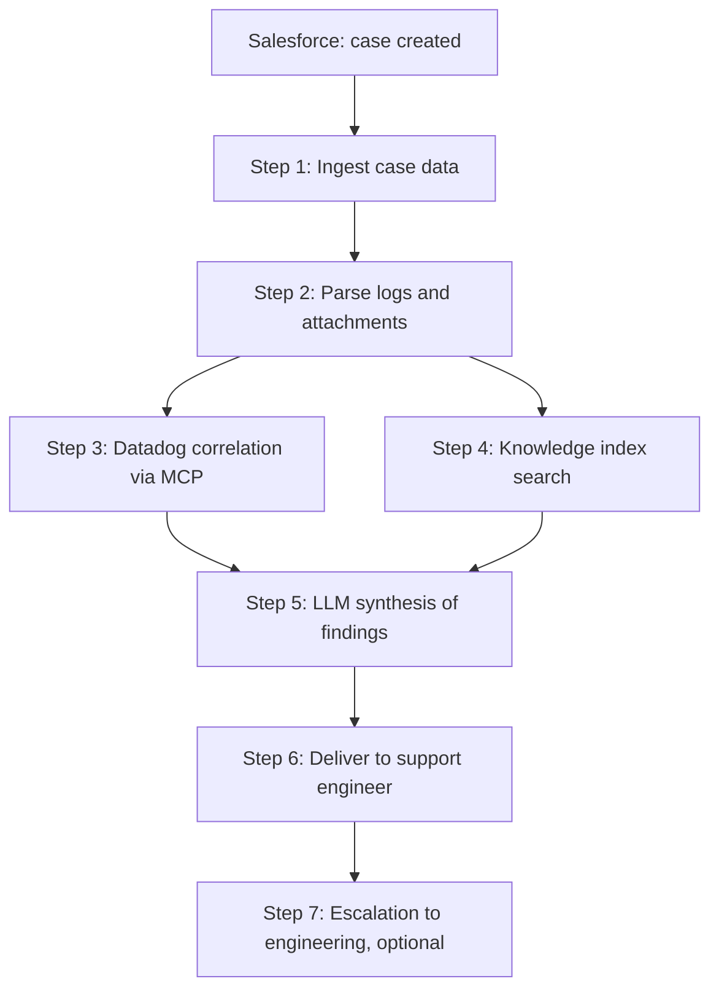

# Sync Agent Flow

## Overview

The sync agent is the real-time half of the system. It handles one customer interaction at a time, triggered by a Salesforce case creation event.

It does not make decisions independently. It investigates, synthesizes, and routes the findings to a human.

This doc describes the Phase 1 flow, where the agent produces an investigative summary and a list of suggested next actions for the support engineer. Drafting customer-facing responses is Phase 2 and is sketched in a section at the bottom. Customer-facing deflection in Experience Cloud is later still ([roadmap](../overview/03-phased-roadmap.md)).

---

## Trigger

A case is created in Salesforce. A Flow with an HTTP callout fires the agent, using the same Apex REST pattern as the existing support portal onboarding integration. The callout payload includes the case ID, customer ID, case description, attachment metadata, and any structured fields the customer filled in.

The agent acknowledges and works the rest asynchronously. The support engineer is not blocked while it runs.

---

## Flow

### Step 1 — Ingest Case Data

The agent pulls everything it needs from Salesforce given the case ID:

- Case description and any custom fields
- Attachments (logs, screenshots, exported config)
- Customer account context: segment, ARR, renewal status, account tier, any open cases for the same account

The Salesforce call uses the same Apex REST endpoint pattern as the existing onboarding integration, no new auth or callout machinery.

### Step 2 — Parse Logs and Customer-Submitted Content

Most cases include attached logs or pasted error output. The agent extracts and normalizes this content so the LLM has something structured to reason about.

For Phase 1 the parsers cover the top three log formats we see in real cases. New formats are added on demand as we see them.

Output of this step: a normalized representation of the customer's evidence, with timestamps, error codes, and identifiers extracted into fields the next steps can use.

### Step 3 — Correlate with Datadog

Using the timestamps, customer identifiers, and error patterns from Step 2, the agent queries Datadog via the Datadog MCP for time-correlated server-side signal:

- Errors and exceptions in the relevant service during the customer's reported window
- Anomalies in latency, error rate, or throughput around the same time
- Related deployments or config changes
- Recent alerts that could be relevant

The MCP returns whatever it returns. If Datadog has nothing relevant during the window, the step records that and moves on. The investigation does not block on Datadog being silent.

### Step 4 — Search the Knowledge Index

The agent queries the index built by the [knowledge pipeline](03-knowledge-pipeline.md) for similar past cases.

Search order:
1. Existing Salesforce cases. Has this account or a similar account seen this before?
2. Zendesk archive. What did we do last time something like this came in?
3. Jira. Is this a known bug or a reported issue, and is there a workaround?

Top matches from each source go to the synthesis step alongside the case data and the Datadog signal.

### Step 5 — Synthesize Findings

The LLM receives:

- Case description and parsed customer-submitted evidence
- Customer context (segment, ARR, renewal status)
- Datadog signal from the relevant window (or "no signal" if Datadog was quiet)
- Top matches from the knowledge index with source attribution
- Instructions on output format

It produces a structured findings document with:

- A one-line summary of what looks to be happening
- Supporting evidence, with explicit citation to the source (which log line, which Datadog query, which past case)
- A confidence indicator (high, medium, low) based on how well the evidence converged
- A list of suggested next investigative actions, ordered by likely value

Low-confidence findings are flagged. The support engineer should treat them as a starting point, not a recommendation.

### Step 6 — Deliver to the Support engineer

The findings are delivered to the support engineer through whatever channel the team agrees on (Slack DM or thread, case comment, email; decision in [Open Questions](05-open-questions.md)).

The delivery includes:

- Case link
- One-line summary
- Confidence indicator
- Findings with cited evidence
- Suggested next investigative actions
- A feedback prompt: was this useful, was it accurate, what was missing

The feedback signal is what drives iteration on the prompt and retrieval logic. Without it we're guessing about quality.

### Step 7 — Escalation Path

If the support engineer escalates the case to engineering, the same findings (or a slightly enriched engineering-flavored version) are surfaced to the engineering team alongside the escalation. Engineering does not get a different agent. They get the same investigation with whatever additional context is added by the support engineer.

---

## Flow Diagram

Steps 3 and 4 run in parallel when the orchestrator supports it, since neither depends on the other.

---

## What the Agent Does Not Handle in Phase 1

- Drafting customer-facing responses (Phase 2)
- Sending anything to a customer (always behind human approval, this is permanent)
- Escalation decisions (the support engineer makes those)
- Billing or contract questions
- Issues requiring access to customer environments
- Phone or video call workflows

---

## Future Scope (Sketched, Not Designed)

These are the parts of the original sync agent design that are out of scope for Phase 1 but remain on the roadmap.

**Customer response drafting (Phase 2).** Once findings are reliable, the same agent produces a customer-ready draft response in addition to the support-team-facing findings. Draft goes through the same human-review gate before sending. Customer context shapes tone and priority.

**Guided intake (Phase 3).** Before case submission, the agent asks the customer for the structured information that the parsers in Step 2 currently have to extract from free-form attachments. Reduces the parsing burden and improves intake quality.

**Customer-facing surface (Phase 4, form TBD).** Latest in the rollout regardless of form. Two possibilities live alongside each other in the [roadmap](../overview/03-phased-roadmap.md): free self-service deflection (agent surfaces docs and past resolutions to the customer before a ticket exists) and a paid self-healing service (a productized version of the investigative aid sold to customers as an upcharge in their admin console). Highest blast radius regardless of form, which is why it ships last.
