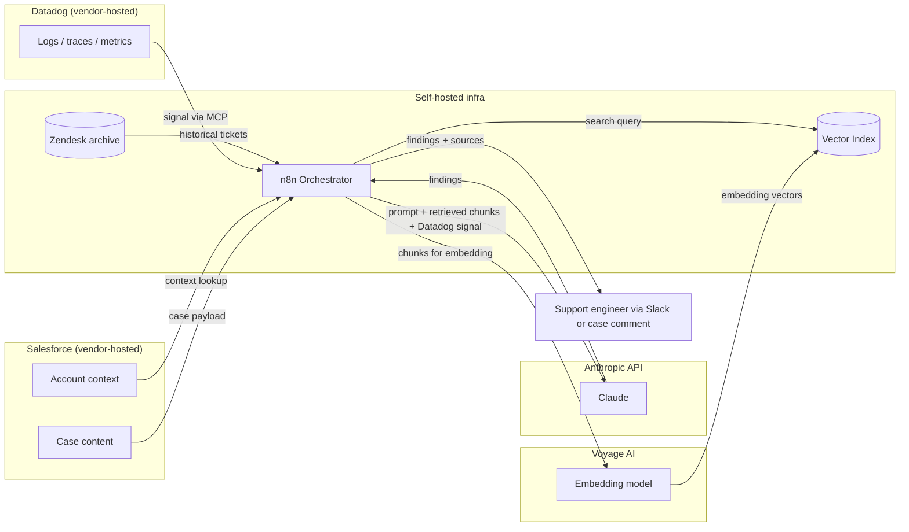

# Data Handling and Privacy

## Why This Doc Exists

Customer ticket content will pass through systems we don't fully control, including the Anthropic API. Engineering and ops will want a clear picture of what data goes where, what crosses a network boundary, and what contractual coverage we have. This is that picture.

If anything below is wrong relative to current commercial terms or the org's data classification policy, flag it and we update. The goal is for nobody to be surprised after Phase 1 ships.

---

## What Data the System Touches

In rough order of sensitivity:

**Customer-submitted content.** Ticket subject lines, descriptions, attachments, error logs, version numbers. Whatever the customer types or pastes into a case. Treat as the highest-sensitivity input. May contain customer environment details, internal customer data, or in worst cases, PII the customer shouldn't have included.

**Server-side observability data.** Datadog logs, traces, metrics, and alerts pulled at investigation time via the Datadog MCP. May contain internal service identifiers, customer IDs in log fields, internal stack traces, and operational details we'd rather not see escape. Treat as internal-confidential.

**Resolution notes from support engineers.** Free-text notes attached to historical tickets, both Zendesk archive and current Salesforce cases. May reference customer accounts, names, internal escalation context.

**Customer account data.** Segment, ARR, renewal status, account tier. Pulled from Salesforce on demand by the sync agent. Sensitive but well-structured.

**Internal documentation.** GitLab docs, Confluence, the support guide. Lower sensitivity individually but a leak of the consolidated index would be a meaningful disclosure of internal practices.

**Jira issues.** Engineering bug reports, customer-reported issues with internal linking. Mixed sensitivity.

---

## Data Flow and Trust Boundaries

Every arrow that crosses a subgraph boundary is a place where data leaves a system we control. The external destinations are Anthropic and Voyage AI. Salesforce and Datadog are vendor-hosted but already part of our supply chain.

---

## Anthropic API Posture

Confirm against the contract that's actually in place, but the standard Anthropic commercial terms cover the following points:

**Training.** API traffic is not used to train Anthropic models by default under the commercial Terms of Service. This is the load-bearing commitment for sending customer content through the API.

**Retention.** Anthropic retains API request and response data for a limited window for abuse monitoring and operational purposes. Zero data retention can be requested under specific commercial agreements, which is worth confirming if our customer contracts require it.

**Sub-processors.** Anthropic uses cloud infrastructure providers as sub-processors. The list is published and should be reviewed against any restrictions in our customer contracts.

**Data residency.** Anthropic offers regional API endpoints. If any customer contract requires data to stay in a specific region, verify that the regional endpoint is being used and that the chosen embedding provider matches.

**What we need to confirm before Phase 1:**
- We have a commercial agreement with Anthropic, not an individual developer plan, and the DPA is signed.
- The retention posture matches what our customer contracts require.
- The regional endpoint matches any data residency obligations.

---

## Voyage AI (Embedding Provider)

Same questions, different vendor. Embeddings are derived from chunks of indexed content, so the same data classifications apply. Confirm DPA, retention posture, and regional endpoint before sending production data.

If the answers are unsatisfactory, fall back to a self-hosted open-source embedding model. That removes the second external vendor at the cost of additional ops work.

---

## Datadog Posture

The Datadog MCP queries Datadog APIs on the agent's behalf and returns server-side signal at investigation time. Two things matter here.

**Datadog is already in our supply chain.** This is not a new vendor. The DPA, retention posture, and access controls already in place for Datadog cover this use case. The change is who is making the queries and what's done with the results.

**The MCP is the new piece.** Whether we're standing up an internal MCP, using a third-party one, or running an open-source MCP in our own infrastructure changes the answer to "where do Datadog credentials live and who can query what." This decision is captured in [Open Questions](05-open-questions.md) and tracked as a Phase 1 prerequisite.

**Output handling.** Datadog responses go into the LLM prompt alongside the case data. The same posture applies as everything else sent to Anthropic. Audit log captures the query, the response size, and a hash of the prompt body.

---

## What We Should Not Send to External APIs

Even with good contractual coverage, certain data shouldn't leave our infrastructure under any circumstance:

- Authentication tokens, API keys, session cookies, anything that grants access to a system
- Anything explicitly classified as restricted by the org's data classification policy
- Customer attachments above a size threshold, until we've established a secure handling pattern for them

The processing engine should strip or mask these patterns before content is sent for extraction. Implementation detail to be settled in Phase 1 build, but the rule is set now.

---

## What Stays Inside Our Infrastructure

Everything else. Specifically:

- The full vector index. No external mirror, no managed-cloud version of the index in Phase 1.
- Raw Zendesk archive and ticket attachments.
- The processing engine itself, including extraction prompts (they shouldn't be sensitive, but no reason to expose them).
- Logs of every extraction and search call, for audit and debugging.

---

## Audit and Logging

Every LLM call from the pipeline or the sync agent gets logged with: timestamp, source record (or query), model used, token counts, and a hash of the prompt body. Full prompt bodies are retained for a short window for debugging and dropped after that.

This gives us a way to answer "was customer X's data sent to the LLM, when, and what did we ask" if it's ever raised.

---

## Open Questions for Engineering / Legal

1. Is there an existing Anthropic commercial agreement and DPA? If not, who initiates the procurement conversation?
2. Are there customer contracts that impose data residency or retention constraints we need to flag?
3. What's the org's data classification policy and which classifications apply to ticket content?
4. Who owns the audit log and for how long is it retained?
